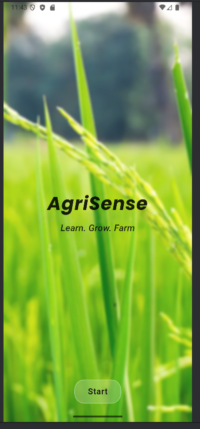
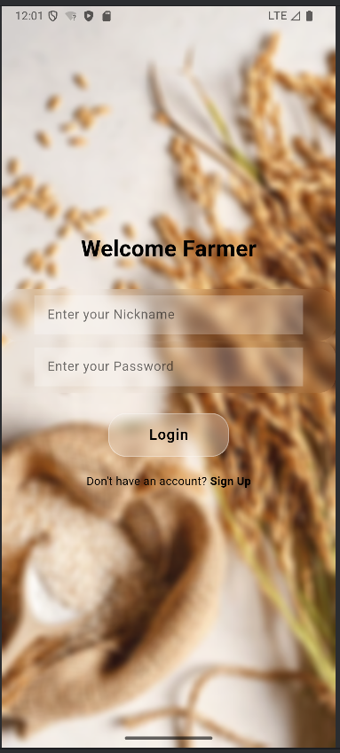
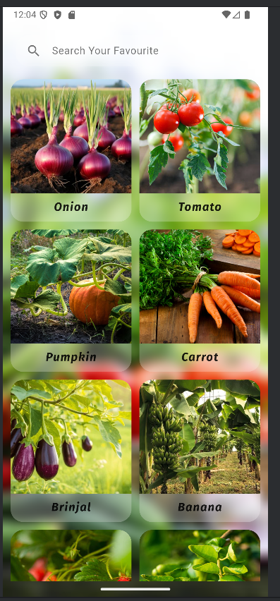
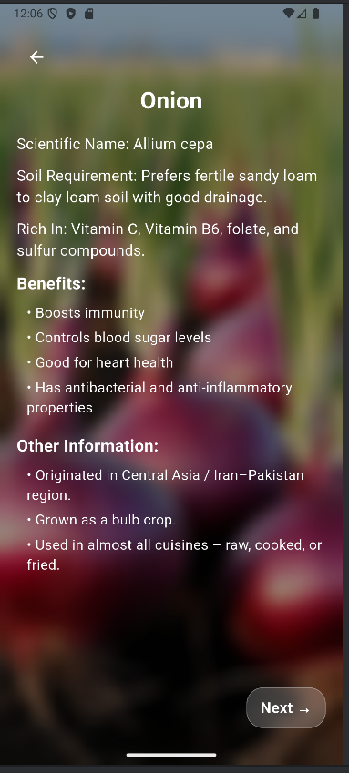
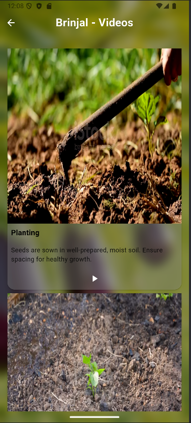
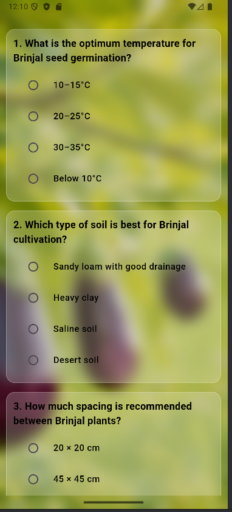
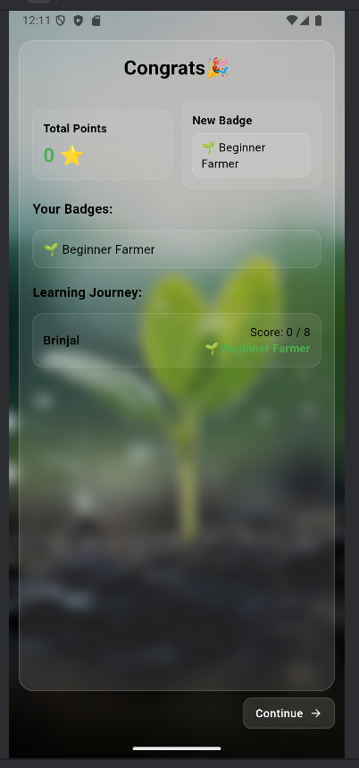

## AgriPlay - UI/UX Learning App

AgriPlay is a Flutter-based mobile application designed with a strong focus on **UI/UX design** to provide an engaging and interactive agricultural learning experience for students and beginners.

---

##  Project Overview

This application delivers agricultural concepts through a clean, intuitive, and visually appealing interface. The design emphasizes **user-friendly navigation, interactive learning, and consistent UI patterns** to enhance user engagement.

---

##  Key Features

-  Intuitive and visually engaging UI design  
-  Smooth and seamless navigation flow  
-  Reusable UI components and structured layouts  
-  Interactive quiz-based learning  
-  Responsive and user-friendly interface  
-  Beginner-friendly agricultural content  

---

##  UI Screens

### Welcome Screen

### Login Screen

### Categories Screen

### Information Screen

### Video Learning Screen

### Quiz Screen

### Reward Screen

---

##  Tech Stack

- **Flutter** – UI Development  
- **Dart** – Programming Language  

---

##  UI/UX Focus

This project was developed with strong emphasis on:

- Layout and visual hierarchy  
- Consistency in design components  
- Clean typography and spacing  
- Interactive user flows  
- User-centered design approach  

---

##  Purpose

The goal of AgriPlay is to make agricultural education **interactive, accessible, and engaging** through modern UI/UX design principles.

---

##  Note

This project highlights **UI/UX design and front-end implementation** using Flutter, showcasing the ability to build clean and interactive user interfaces.

---

